## The DWBA app vignette and prerequisites
This vignette is a guide to the DWBA [shiny web application](https://shiny.rstudio.com/) `DWBAapp()`. The DWBAapp() has been specifically designed, to easily and quickly create ZooScat config files, and visualise the DWBA output of singular simulations. The availability of config files allows for quick and easy parametrisation of [one single core]("DwbaCommand.html") or [multiple parallelised DWBA simulations](Parallelise DWBA sweeps.html). More information on the DWBA model can be found in [this vignette]("DwbaCommand.html") and a validation of the model, comparing outcomes to an analytical model can be found in [this vignette]("CompareToAnalyticalSolution.html"). 

The `DWBAapp()` function is included in the ZooScat package and depends on:  

* [shiny](https://shiny.rstudio.com/) - to build the shiny app [@shiny]
* [shinyjs](https://cran.r-project.org/web/packages/shinyjs/index.html) - for some features like  showing/hiding tabs inside the shiny app [@shinyjs]
* [ggplot2](https://cran.r-project.org/web/packages/ggplot2/index.html) - for nicer plots [@ggplot]
* [reshape2](https://cran.r-project.org/web/packages/reshape2/index.html) - for easy reshaping of datframes to be plotted in ggplot2 [@reshape2]
* [pracma](https://cran.r-project.org/web/packages/pracma/index.html) - for some Matlab-like mathematical operations [@pracma]  

The `ZooScat` package has to be loaded into R:

```{r warning=FALSE}
library(ZooScat)
```

## Starting the app  
The easiest way to start the application is through:

```{r eval=FALSE}
DWBAapp()
```

This will launch an R preview window with the app. It is recommended to open the app in an independent browser such as [Chromium](https://www.chromium.org/), [Chrome](https://www.google.com/chrome/), [Opera](https://www.opera.com/) or [Firefox](https://www.mozilla.org/en-US/firefox/new/).  

{width=700px}

### Opening in a browser  
Opening the app in a separate browser window can be achieved either though clicking Open in Browser in the R preview pane or by opening a ne browser Window and pasting the address and port at which the app is running. Running `DWBAapp()` will provide the address and port as `Listening on http://127.0.0.1:7411` where the address should correspond to the localhost and the last four digits represent the port. 

### Running a first model  
Clicking the Run Model button will run a DWBA model for a uniformly bent cylinder with generic shape, orientation, material and simulation settings.  

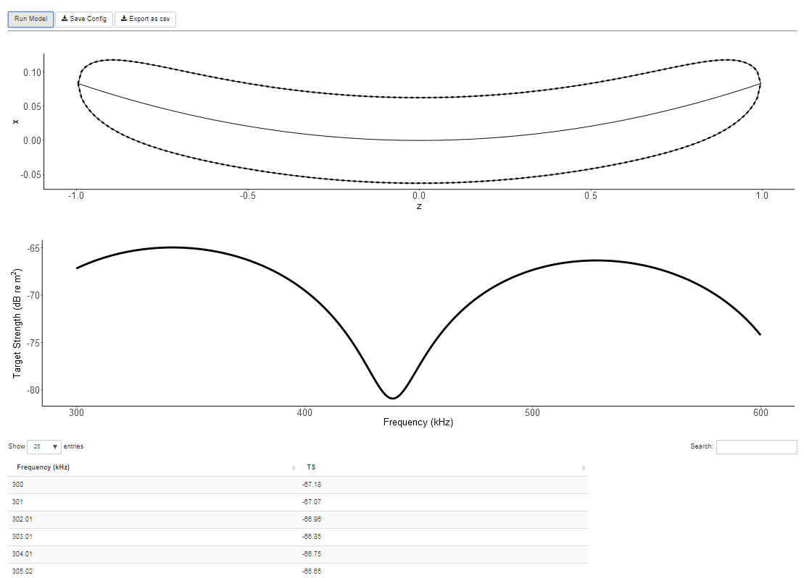{width=400px align=centre}  

## General app concept  
The app is composed of two main panes:  
The settings pane (left), where all model parameters can be set. Four different types of model input parameters an be defined:  

1. Shape
2. Orientation
3. Orientation
4. Simulation  

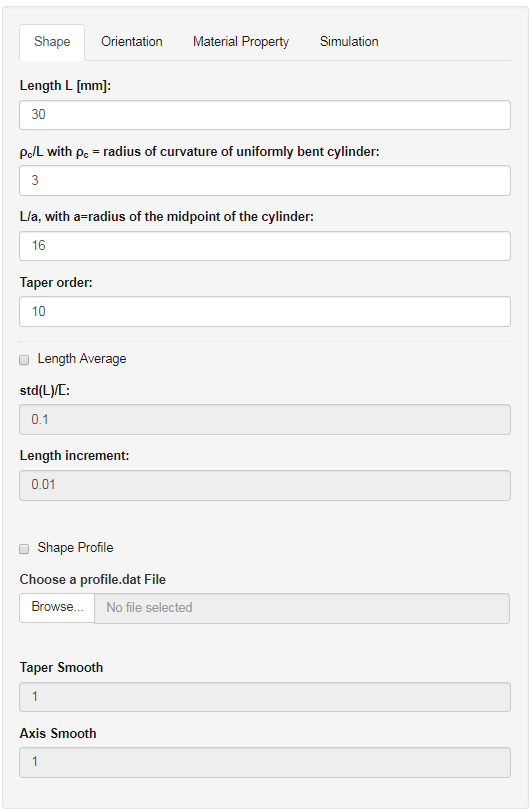{width=200px align=centre}  

The second pane is the results pane (right) where the model outputs will be shown or can be exported as csv file and where general config files can be loaded or the current settings be saved as config file. A detailed description of the config files can be found in the config file section of this vignette.  
  
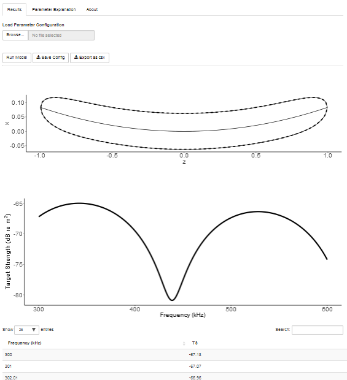{width=200px align=centre}  
   
The quickest way to run a specific model is through loading a configuration file into the app. All settings can then be adjusted through the app. Once the right settings have been set the config file can be saved for future use. If no config file is available, all settings can be adjusted from scratch.  

To load a config file, hit the borwse button under `Load Parameter Configuration` within the `Results Tab` of the Results pane.  

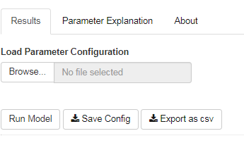{width=400px align=centre}  

  
#### Getting additional information on the model input variables  
Clicking on any of the input titles will open a little popup window in the lower right corner of the screen with some information on the selected variable. These popups are colour coded with blue = information, yellow = warning, red = error. Warnings will for example appear if the density or soundspeed contrast are set beyond the recommended limits.  

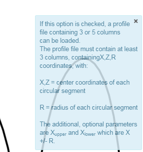{width=150px align=centre}


A list of all parameters, the respective name in the app and the model code, the meaning, the unit and the influence on the model are explained in the table of the Parameter Explanation tab within the result pane.

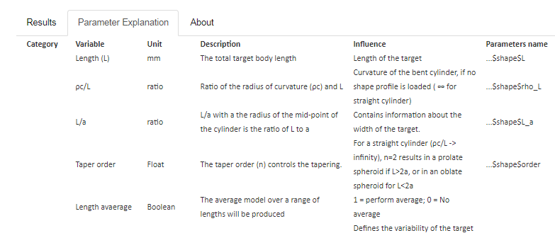{width=600px align=centre}


### The results plots  
The first plot in the result pane shows the shape for which the model was run (generated by the `buildpos(para)` function), defined by the shape settings.  
The second plot represents the model output, dependent on all the model parameters (generated by `bscat(para, misc)` function.  

#### Getting values from the result plot  
Moving the mouse over the second plot will display the current position of the mouse, the closest y-axis value and the euclidean distance to this value from the current mouse position.  

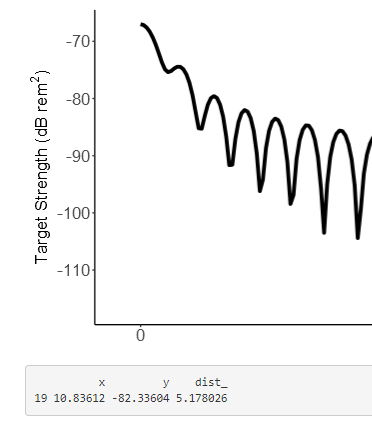{width=200px align=center}

#### Zooming into the result plot  
Holding the left mouse button allows the drawing of a zoom box on the result plot. Double-clicking into the box will zoom into the selected area. This step can be repeated indefinetely. Double clicking into the plot without a box will zoom out back to to full plot extend.  

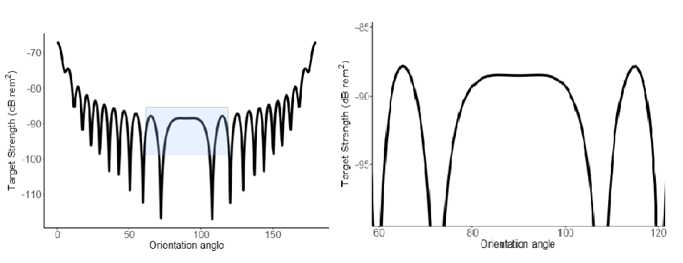{width=700px align=center}

### The results table  
The results table shows the model outcome values.  
The number of displayed items per page can be changed by changing the value of the `Show ... Entries` SelectBox at the top left corner of the table.  
The table can be searched for any values in the search box.  
The table can be sorted in increasing or decreasing order for the values of a given column by clicking on the column header.  
The table values can be exported as comma-separated (csv) file by clicking the Export as csv button on top of the results page. This will open a file input menu where the output folder and filename can be set.  

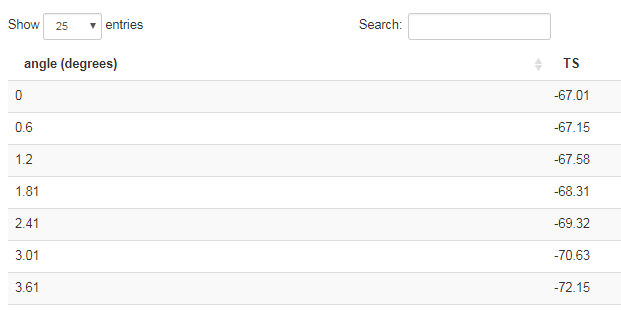{width=400px align=centre}  


## The config file

### Config file template  

Config file can be created outside of the app or be edited using a standard text editor. It is important though to keep the original format.  
The code below is an example config file, which corresponds to the `config1.dat` in the package config example data folder (*`r paste0(system.file(package="ZooScat"),"/extdata/configs/")`*):  

```
%% home directory

%% shape	parameters
30		% length in mm
3		% rho/L
16		% L/a
10		% tapering order
0		% length average flag: 0-no average,	1-average
1.000000e-01		% relative length standard deviation (meaningless for no average)
1.000000e-02		% relative length increment(meaningless for no average)
-1	 % shape profile name ( "-1" if profile is not specified)
10		% number of points for axis smoothing (meaningless if profile is not specified)
40		% number of points for tapering function smoothing (meaningless if profile is not specified)
%% orientation parameters
-60		% mean incident angle (deg)
-60		% angle variation range - starting value (deg)
-60		% angle variation range - ending value (deg)
0		% average option flag: 0-no average,	1-average
2		% PDF flag: 1-Uniform		2-Gaussian
20		% PDF parameter: half range for Uniform PDF,
%		% standard deviation for Gaussian (deg)
%		% (meaningless for no average)
1		% angle increment	(meaningless for no average)
%% physical property parameters
1.035700e+00		% mean density contrast (g0)
1.027900e+00		% mean sound speed contrast (h0)
1		% number of body segments (1-homogeneous body)
1.600000e-03		% standard deviation of g0 (meaningless for homogeneous body)
1.500000e-03		% standard deviation of h0 (meaningless for homogeneous body)
20		% correlation length as a percentage of body length L
%% simulation parameters
2000		% integration	points along body axis
1000		% number of output points
3		% output variable index: 1-scatting amplitude, 2-cross section, 3-TS, 4-RTS
1		% variable: 1-frequency (kHz), 2-ang(deg),  3-ka
10		% start value for the variable
600		% end value for the variable
120		% frequency (kHz), enabled for available being angle only
```  
## The model parameters

### Shape parameters

```{r echo=FALSE} 
para.df <- as.data.frame(cbind(Variable = c("Length(L)",
                                      "ρc/L",
                                      "L/a",
                                      "Taper order",
                                      "Length average",
                                      "std(L)/L",
                                      "Length increment",
                                      "Shape profile",
                                      "Taper smooth",
                                      "Axis smooth"),
                         Unit = c("mm",
                                  "ratio",
                                  "ratio",
                                  "float",
                                  "boolean",
                                  "mm",
                                  "mm",
                                  "filepath",
                                  "float",
                                  "float"),
                         Description = c("The total target body length",
                                         "Ratio of the radius of curvature (ρc) and L",
                                         "L/a with a the radius of the mid-point of the cylinder is the ratio of L to a",
                                         "The taper order (n) controls the tapering.",
                                         
                                         "The average model over a range of lengths will be produced",
                                         "The ratio of the standard deviation of length (std(L)) to the mean length (L)",
                                         "This value has to be chosen with care, as it has to be possible to calculate the provided std(L)/mean(L) around the provided mean L with the given increment.",
                                         "Path to a profile file containing 3 or 5 columns. (X, Z, R coordinates and optional Xupper Xlower). The profile file must contain at least 3 columns, containing the center coordinates (X, Z, R) of each circular segment",
                                         "Filter length to smooth the radius (R)",
                                         "Filter length to smooth the body axis (X, Z)"),
                         Influence = c("Length of the target",
                                       "Curvature of the bent cylinder, if no shape profile is loaded ( ∞ for straight cylinder)",
                                       "Contains information about the width of the target.",
                                       "For a straight cylinder (ρc/L -> infinity), n=2 results in a prolate spheroid if L>2a, or in an oblate spheroid for L<2a",
                                       "1 = perform average; 0 = No average",
                                       "Defines the variability of the target lengths, used to compute the input models for the averaged model output",
                                       "Defines the length increment of the target lengths, used to compute the input models for the averaged model output",
                                       "Defines the shape of the target, if no profile is selected a uniformly bent cylinder will be computed",
                                       "1 = no smoothing, otherwise smoothes the tapering (reduces complexity)",
                                       "1 = no smoothing, otherwise smoothens the axis (flatter)"),
                         "Parameters name" =
                           c("...shape$L",
                             "...shape$rho_L",
                             "...shape$L_a",
                             "...shape$order",
                             "",
                             "...shape$Lstd",
                             "...shape$dL",
                             "...shape$prof_name",
                             "...shape$taper_sm",
                             "...shape$axis_sm")
                         ))
knitr::kable(para.df)
``` 

#### Shape profile files  
Shape profile files are loaded into the `buildpos` function and generate a shape in combination with the other shape settings.  
Shape profiles must contain at least three columns without headers, describing the X, Z coordinates and the radius R. Two additional columns, describing the upper and lower extend of the cylinder can be included.  
The following is a minimal example, describing a generic krill:  

```
0.0000	38.3500	0.0000
0.9149	36.8563	0.2147
1.7924	34.0464	0.6525
2.4552	29.4160	1.1296
2.4365	26.6247	1.3537
2.4552	23.5253	1.4470
2.3059	20.6967	1.5964
2.2498	17.7000	1.5497
2.0538	15.1888	1.6524
1.8484	12.8456	1.9044
1.6897	10.5304	1.7551
1.6897	8.46720	1.6524
2.0631	6.64680	1.3816
2.4739	2.96870	1.1016
3.5568	0.00000	0.5508
```  

Some example shape profiles can be found in *`r paste0(system.file(package="ZooScat"),"/extdata/profiles/")`*  

### Orientation parameters  

```{r echo=FALSE} 

orient.df <- as.data.frame(cbind(Variable = c("Mean Theta (θ)",
                                      "Orientation Average",
                                      "Theta Distribution (dθ)",
                                      "Min. Theta (θmin)",
                                      "Max. Theta (θmax)",
                                      "Std.(θ)",
                                      "Increment θ"),
                         Unit = c("°",
                                  "Boolean",
                                  "distribution (Uniform or Gaussian)",
                                  "°",
                                  "°",
                                  "°",
                                  "°"),
                         Description = c("Mean orientation angle",
                                         "Defines if an orientation average should be considered",
                                         "PDF of theta",
                                         "Minimum theta for a uniform PDF",
                                         
                                         "Maximum theta for a uniform PDF",
                                         "Standard deviation of theta for a Gaussian PDF",
                                         "Incremental step of theta for a Gaussian PDF"),
                         Influence = c("",
                                       "",
                                       "1) Uniform; 2) Gaussian","","","",""),
                         "Parameters name" =
                           c("...orient$angm",
                             "...orient$ave_flag",
                             "...orient$PDF",
                             "...orient$ang0",
                             "...orient$ang1",
                             "...orient$PDF_para",
                             "...orient$dang")
                         ))
knitr::kable(orient.df, keep.line.breaks = TRUE, style = 'grid', justify = 'left')
```  

### Material properties parameters
   
  
```{r echo=FALSE} 

mat.df <- as.data.frame(cbind(Variable = c("Density contrast (g)",
                                      "Soundspeed contrast (h)",
                                      "Ambient Soundspeed (c)",
                                      "N body segment",
                                      "std(g)",
                                      "std(h)",
                                      "Correlation Length"),
                         Unit = c("ratio",
                                  "ratio",
                                  "m/s",
                                  "Integer",
                                  "std of ratio",
                                  "std of ratio",
                                  "% of L"),
                         Description = c("the ratio of the density of the animal to the density of the surrounding fluid",
                                         "the ratio of the sound speed in the animal to the sound speed in the surrounding fluid",
                                         "Soundspeed in surrounding fluid",
                                         "Defines the number of segments with different gi and hi along the body axis (>1 if an inhomogenous body should be computed).",
                                         
                                         "Standard deviation of the density (g), if an inhomogenous body should be computed",
                                         "Standard deviation of the sound speed contrast (h), if an inhomogenous body should be computed",
                                         "Controls the variability of g and h along the body axis (only xonsidered if the number of segments is >8)"),
                         Influence = c("Influences acoustic impedance, should be within [0.95, 1.05]",
                                       "Influences acoustic impedance, should be within [0.95, 1.05]",
                                       "","","","",""),
                         "Parameters name" =
                           c("...phy$g0",
                             "...phy$h0",
                             "...misc$cw",
                             "...phy$seg_no",
                             "...phy$g_std",
                             "...phy$h_std",
                             "...phy$corrL")
                         ))
knitr::kable(mat.df, keep.line.breaks = TRUE, style = 'grid', justify = 'left')
```  
  
#### Calculating soundspeed in water

Ambient soundspeed (c) is an import input into the model. Basic parameters, such as wavelength dependt directly on c. In combinaiton with the soundspeed contrast (ratio between the soundspeed inside and outside the scattering target), the soundspeed inside the target can be calculated. This underlines the importance of having good estimates of soundspeed contrast for similar targets at similar ambient conditions.  

Inside DWBAapp, c can be computed by clicking on the `Calculate c based on Salinity, Temperature and Depth` link on the `Material properties` tab (located under the Ambient Soundspped input). This will open a new tab in the result pane.  

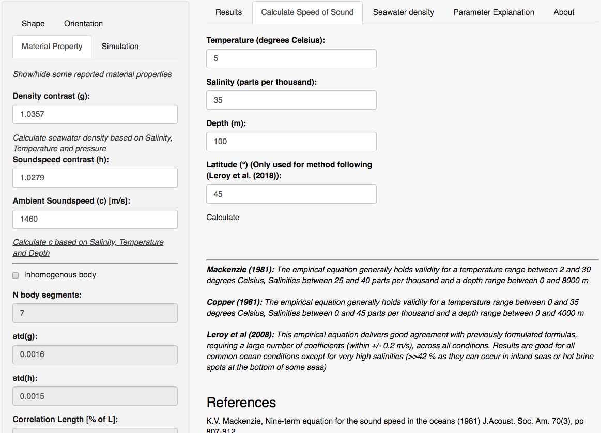{width=700px align=centre}  

  
Three different methods of calculating ambient soundspeed are currently implementd in ZooScat:  

* Coppens 1981 [@coppens_simple_1981] (`c_Coppens1981`)  
Calculates speed of sound in seawater based on Coppens (1981) The empirical equation generally holds validity for a temperature range between 0 and 35 degrees Celsius, Salinities between 0 and 45 parts per thousand and a depth range between 0 and 4000 m. This empirical formula takes three input values (Depth (D) in m, Salinity (S) in ppt and Temperature (T) in degrees Celsius:

$$t = T/10; D = D/1000 $$
$$c_0 = 1449.05 + 45.7t - 5.21 t^2 + 0.23 t^3 + (1.333 - 0.126 t + 0.009 t^2) (S - 35) $$
$$c = c_0 + (16.23 + 0.253t) D + (0.213 - 0.1t) * D^2 + (0.016 + 2e^{-04} (S - 35)) (S - 35)tD$$  

* Mackenzie 1981 [@mackenzie_nine-term_1981] (`c_Mackenzie1981`)  
Calculate speed of sound in seawater based on MacKenzie (1981) The empirical equation generally holds validity for a temperature range between 2 and 30 degrees Celsius, Salinities between 25 and 40 parts per thousand and a depth range between 0 and 8000 m. This empirical formula takes three input values (Depth (D) in m, Salinity (S) in ppt and Temperature (T) in degrees Celsius: 

$$1448.96 + 4.591 T - 5.304 10^{-2} T^2 + 2.374 *10^{-4} T^3 +\\ 
1.34 (S - 35) + 1.63 * 10^{-2}D + 1.675 * 10{^-7} D^2 - \\
1.025 * 10^{-2} T (S -35)-7.139 * 10^{-13}  T  D^3$$

* LeRoy 2008 [@leroy_new_2008] (`c_Leroy08`)  
Returns the sound speed according to Leroy et al (2008). This "newer" equation should solve the sound speed within 0.2 m/s for all seas, including the Baltic and Black sea, based on Temperature, Salinity and Latitude. Exceptions are some seas with anomalities close to the bottom. The equation was specifically designed to be used in marine acoustics. This empirical formula takes three input values (Depth (D) in m, Salinity (S) in ppt, Temperature (T) in degrees Celsius, and Latitude (lat) in degrees:

$$ 1402.5 + 5 T - 5.44 * 10^{-2} T^2 + 2.1 * 10^{-4} T^3 + 1.33 S -\\ 
        1.23 * 10^{-2} S T + 8.7 * 10^{-5} S T^2 + \\
        1.56 * 10^{-2} Z + 2.55 * 10^{-7} Z^2 - \\
        7.3 * 10^{-12} Z^3 + 1.2 * 10^{-6} Z (lat - 45) -\\ 
        9.5 * 10^{-13} T Z^3 + 3 * 10^{-7} T^2 Z + 1.43 10^{-5} S Z$$

#### Calculating water density  
  Depending on the method used to compute the density contrast of the target to the surrounding fluid, the density rather then the density contrast might be obtained. In order to get the density contrast at ambient conditions, it is important to know the density of the surrounding fluid. Within ZooScat the density of water can be calculated, following formulas found in the Tenth report of the joint panel on oceanographic tables and standards. UNESCO Technical Papers in Marine Science, Paris, 25p [@unesco_tenth_1981].  
  
  Inside DWBAapp, $\rho$ can be computed by clicking on the `Calculate seawater density based on Salinity, Temperature and pressure` link on the `Material properties` tab (located under the Density Contrast input). This will open a new tab in the result pane, where Temperature, Salinity and Pressure can be entered.  
  
  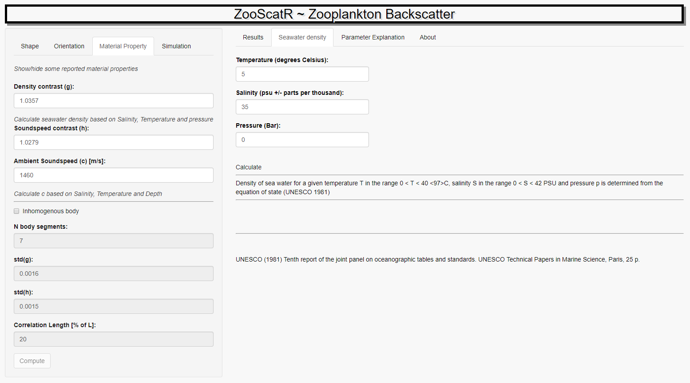{width=700px align=centre}  

Following the UNESCO Standard, density is calculated in four steps:  
  
  First the density of Standard Mean Ocean Water ($\rho_smow$) with temperature (T) in degree Celsius:
  $$a0 = 999.842594 \\
    a1 = 6.793953 * 10^-2 \\
    a2 = -9.09529 * 10^-3 \\
    a3 = 1.001685 * 10^-4 \\
    a4 = -1.120083 * 10^-6 \\
    a5 = 6.536332 * 10^-9 \\
    \rho_{smow}(T) = a0 + a1 * T + a2 * T^2 + a3 * T^3 + a4 * T^4 + a5 * T^5$$
    
  Density at depth is dependent on the compressibility ($\kappa$):  
  $$ h_0 = 3.2399 \\
    h_1 = 1.43713 * 10^{-3} \\
    h_2 = 1.16092 * 10^{-4} \\
    h_3 = -5.77905 * 10^{-7} \\
    i_0 = 2.838 * 10^{-3} \\
    i_1 = -1.0981 * 10^{-5} \\
    i_2 = -1.6078 * 10^{-6} \\
    j_0 = 1.91075 * 10^{-4} \\
    k_0 = 8.50935 * 10^{-5} \\
    k_1 = -6.12293 * 10^{-6} \\
    k_2 = 5.2787 * 10^{-8} \\
    m_0 = -9.9348 * 10^{-7} \\
    m_1 = 2.0816 * 10^{-8} \\
    m_2 = 9.1697 * 10^{-10} \\
    B_w = k_0 + k_1 T + k_2 T^2 \\
    B_2 = B_w + (m_0 + m_1 T + m_2 T^2) S \\
    A_w = h_0 + h_1 T + h_2 T^2 + h_3 T^3 \\
    A_1 = A_w + (i_0 + i_1 T + i_2T^2) S + j_0 S^{1.5} \\
    K_{p0}(S, T) + A_1 p + B_2 * p^2 $$
  
  Then the density of seawater with Salinity (S in psu +/- ppm) at pressure (p in bar) = 0 is computed ($\rho_0$:  
  
  $$b_0 = 8.2449 * 10^-1 \\
    b_1 = -4.0899 * 10^-3 \\
    b_2 = 7.6438 * 10^-5 \\
    b_3 = -8.2467 * 10^-7 \\
    b_4 = 5.3875 * 10^-9 \\
    c_0 = -5.7246 * 10^-3 \\
    c_1 = 1.0227 * 10^-4 \\
    c_2 = -1.6546 * 10^-6 \\
    d_0 = 4.8314 * 10^-4 \\
    B_1 = b_0 + b_1 T + b_2 T^2 + b_3 T^3 + b_4 T^4 \\
    C_1 = c_0 + c_1 T + c_2 T^2 \\
    \rho_0(S,T)=\rho_{smow}(T) + B_1 S + C_1 * S^{1.5} + d_0 S^2 $$
    
Density at a given pressure is then computed as:  
$$ \rho = \frac{\rho_o(S,T)}{1-\frac{p}{K(S,T)}}$$

#### Getting some example values for g and h  

It is important to only use the DWBA model provided here for low density and soundspeed contrasts (within 5%). This is illustrated in the validation vignette (``). The DWBA performs very well for weak scatters, such as salps, euphausids, copepods, etc. but would perform very poorly if applied to an almost rigid target, such as a target sphere.  
Some of the g and h found in literature are summarised in a table which can be accessed within DWBAapp through clicking on `how/hide some reported material properties ` the first link in the `Material properties` tab. This will open a new tab in the results pane.

#### Generating a body with multiple g and h values  

For more complex scatting targets, the internal g and h compard to the external fluid can be varied.

### Simulation parameters  
  
```{r echo=FALSE} 

simu.df <- as.data.frame(cbind(Variable = c("Output",
                                      "Variable",
                                      "Sample points",
                                      "Integration Points",
                                      "Variable start value",
                                      "Variable end value",
                                      "Frequency"),
                         Unit = c("Selection",
                                  "Selection",
                                  "Integer",
                                  "Integer",
                                  "Float",
                                  "Float",
                                  "Float"),
                         Description = c("Model variable",
                                         "Number of output points along the variable maximum and minimum value",
                                         "Number of integration points along the target body",
                                         "Resolution of the model variable output",
                                         "Minimum output value",
                                         
                                         "Maximum output value",
                                         "Defines the discrete frequency for which the model is run if the variable is set to angle"),
                         Influence = c("1) backscattering amplitude; 2) differential backscattering cross-section [m2]; 3) Reduced Target Strength [dB re m2]; 4) Reduced Target Strength [db re m2]",
                                         "1) Frequency [kHz]; 2) Angle (°); 3) ka (wave number k * a)",
                                         "Resolution of the model variable output",
                                         "Resolution of the model shape input",
                                         
                                         "Range of the mdel output variable",
                                         "Range of the mdel output variable",
                                         "Center frequency of model variation around a range of theta"),
                         "Parameters name" =
                           c("...simu$out_indx",
                             "...simu$var_indx",
                             "...simu$n",
                             "...simu$ni",
                             "...simu$var0",
                             "...simu$var1",
                             "...simu$freq")
                         ))
knitr::kable(simu.df, keep.line.breaks = TRUE, style = 'grid', justify = 'left')
```  

#### Output selection

#### Variable selection  


## References
